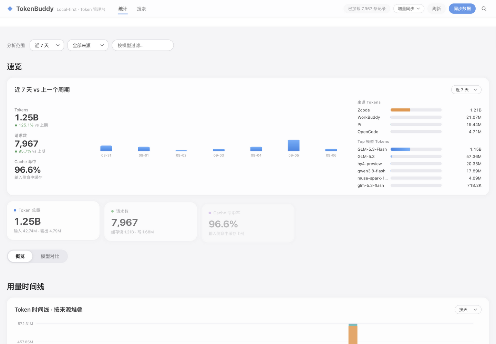

<div align="center">

# TokenBuddy

**WakaTime for AI coding agents — token billing plus full-text conversation
search, running entirely on your own machine.**

*You switch between three AI coding tools. Can you answer where this week's
tokens actually went?*

**4.1 MB single binary · zero runtime deps · <100 MB resident · 43K turns indexed in 2s**

[简体中文说明](README.zh-CN.md) · [Download a Release](../../releases) · [Issues](../../issues) · [MIT](LICENSE)

**Rust** · **macOS / Linux** · **7 agents supported**

</div>

---

TokenBuddy watches the local session logs your AI coding tools already write
and turns them into **one queryable Parquet file** plus a web dashboard that
opens instantly: which tools and models you actually use, how many tokens
(and cache hits, and credits) they burn, when you code — and a full-text
search engine across **every conversation you have ever had with every
agent**.

No cloud. No telemetry. No accounts. Nothing to install. **A single static
binary bound to `127.0.0.1` — privacy here is physics, not a setting.**



## The numbers

| | |
|---|---|
| Single binary | **4.1 MB**, stripped, no runtime dependencies |
| Full clean build | **48 s** (`cargo build --release`, no C++ toolchain) |
| Server memory | **< 100 MB resident** with the full search index over 43K turns (older versions: 379 MB) |
| First index build | 43K conversation turns in ≈ **2 s**, incremental after that |
| Disk footprint | two Parquet files you can read, copy, `rm` |

Every one of those is reproducible on your machine with
`cargo run --release --example memprobe`. No embedded query engine, no
third-party database — aggregation and search are pure Rust.

## Why

Every AI coding tool keeps its own local logs — in its own format, in its own
directory, read by nobody after it is written. Once you run more than one
agent, these questions become unanswerable:

- How many tokens did I burn this week, on which model — and which
  subscription is collecting dust?
- What was my cache-hit rate? Is that context strategy I'm so proud of
  actually working?
- Which tool earns its keep — Claude Code, ZCode, Qoder, OpenCode…?
- *Where did I discuss that threading bug three weeks ago?*

TokenBuddy answers all of it, locally, with one binary.

## Features

### 📊 One bill: every token accounted for

Per-request input / output / cache-read / cache-creation tokens, duration and
TTFT (where the source log reports it), plus host-reported credits for sources
that mask token counts. Rollups by day/hour/week/month, by source, by model,
by model family (`claude-sonnet-4-5-…` → `sonnet`); period-over-period digest,
source comparison, model heatmaps (model × source, model × date). Time buckets
use a fixed UTC+8 offset — no DST surprises.

### 🔍 A time machine: search everything you ever told an agent

The feature you cannot go back from. A pure-Rust inverted index over
user/assistant turns only — tool output and re-sent system context never enter
it, so cached boilerplate doesn't drown real conversations. Documents are
content-hash deduplicated. Tokenizing is two-layer: ASCII tokens with prefix
matching, plus CJK character bigrams that catch matches across any word
boundary; substring verification at query time carries precision — **Chinese
search without a dictionary** (jieba's 55 MB of resident dictionary was tried
and removed; recall stayed, memory dropped). Candidates cascade from strict
term-AND to IDF-weighted ranking, with click feedback and a quality panel.

Compact by construction: text lives in a zstd-compressed arena decompressed
per candidate, posting lists are delta-varint-encoded into one flat arena,
metadata is fully interned. 43K turns index in two seconds under 100 MB —
a **"remember everything" retrieval system that runs on your laptop.**

### 📦 One Parquet, every agent

All sources append into a single `~/.tokenbuddy/data.parquet` (Arrow schema,
zstd). Every aggregation runs a pure-Rust path projecting only the columns it
needs (~62% less read volume). Sync is incremental — already-seen records are
skipped; full rebuilds keep rotated snapshots. Each collector is one small
file in `src/`: adding an agent is a community-friendly pull request, not a
fork of the pipeline.

### 🤖 A skill so your agent can analyze itself

The corpus TokenBuddy builds is machine-readable. Drop in
[`skills/tokenbuddy-analyze/SKILL.md`](skills/tokenbuddy-analyze/SKILL.md) and
your coding agent talks to the local API directly: daily retrospectives, which
flows keep repeating, what should become a skill or a repo rule. Combined with
tiered summarization it costs 90% fewer tokens than feeding raw logs back to
a model (see Agent self-evolution below).

### 🔒 Zero-friction privacy

The server binds to `127.0.0.1:8080`; the codebase contains no outbound
network call, no config option that could export anything, no account. The
entire database is two files. Delete `~/.tokenbuddy/` and TokenBuddy knows
nothing about you again.

## Supported agents

| Tool | `source` id | Notes |
|---|---|---|
| Claude Code | `claude` | reads local JSONL session logs |
| ZCode | `zcode` | |
| Qoder | `qoder` | token counts masked by host; usage tracked via host-reported credits |
| WorkBuddy | `workbuddy` | |
| OpenCode | `opencode` | |
| Mimo | `mimo` | |
| Pi | `pi` | |

## Quick start

**Apple Silicon:** grab
`tokenbuddy-v0.4.0-aarch64-apple-darwin.tar.gz` from
[Releases](../../releases), unpack, run.

**Any other platform, from source** (Rust 1.75+, ~48 s to build):

```bash
git clone https://github.com/walker83/TokenBuddy.git
cd TokenBuddy
cargo b                     # build --release (alias defined in .cargo/config.toml)
./target/release/tokenbuddy
# open http://127.0.0.1:8080
```

- The dashboard loads immediately; the first index build runs in the
  background (search reports its progress instead of pretending to be empty).
- Hit **Sync** (or `POST /api/sync`) to pull the latest logs; the context
  index refreshes alongside automatically.
- In the dashboard, <kbd>/</kbd> focuses the search box from anywhere.

## How it works

```
Claude Code ─┐                            ┌─► ~/.tokenbuddy/data.parquet  ─► pure-Rust agg ─┐
ZCode        │  local session logs        │                                                   ├─► dashboard
Qoder        ├─►  (each tool's own   ─►   │                                                   │   127.0.0.1:8080
WorkBuddy    │     format on disk)        └─► ~/.tokenbuddy/context.parquet ─► in-memory      │
OpenCode     │                                (deduplicated turns)      inverted idx ┘
Mimo / Pi  ──┘
```

Everything right of the arrow is one process: collectors run on sync, Parquet
is both the storage and the exchange format, aggregation and indexing are
pure Rust, and the UI is a single HTML file compiled into the binary.

## Agent self-evolution

What makes self-review affordable is tiered summarization: ~80% of sessions
are two-message throwaways that get a free rule-based digest (the first user
message *is* the intent), and only substantive sessions go to an LLM. On a
real 3,391-session corpus that turned 4.2 MB of raw conversation into ~0.4 MB
of digests — **90% fewer tokens** than feeding raw logs back to a model, with
every session still individually summarized (no sampling).

A practical loop: a daily digest for "what did I do today", a weekly pass
over substantive sessions, a monthly full report — and any flow that shows
up three or more times is a skill candidate.

## Data & privacy

| File | Contents |
|---|---|
| `~/.tokenbuddy/data.parquet` | one row per token-bearing request: source, project, model, tokens, duration, credits… |
| `~/.tokenbuddy/context.parquet` | deduplicated user/assistant turns for search |
| `~/.tokenbuddy/data.parquet.snapshots/` | rotated snapshots kept by full rebuilds (5 retained) |

The HTTP API is local-only by construction. There is no config to leak, no
account, no export target.

## HTTP API

<details>
<summary>All endpoints (click to expand)</summary>

| Method | Path | Purpose |
|---|---|---|
| GET | `/` | dashboard (single embedded HTML file) |
| POST | `/api/sync?mode=incremental\|full` | import new log records, refresh context index |
| GET | `/api/summary?timeRange=&source=&model=` | totals + per-source/per-model rollup |
| GET | `/api/timeline?mode=hourly\|daily\|weekly\|monthly` | bucketed usage |
| GET | `/api/metrics` | per-request metric aggregates |
| GET | `/api/heatmap?mode=model_x_source\|model_x_date&metric=` | heatmap matrix |
| GET | `/api/models` | model comparison table |
| GET | `/api/digest?days=7` | current vs previous window, top models, per-source split |
| GET | `/api/context/search?q=&source=&role=&project=&days=&limit=` | full-text search |
| GET | `/api/context/session?source=&session_id=&doc_id=&around=` | conversation around a hit |
| GET | `/api/context/stats` | index build status + corpus figures |
| POST | `/api/context/click?doc_id=` | record a search-result click (ranking feedback) |
| GET | `/api/context/quality` | search-quality report |
| POST | `/api/context/rebuild` | force a full index rebuild |

</details>

## Development

```bash
cargo b        # build --release
cargo c        # check --release
cargo test --release
```

This repo builds release-only (debug artifacts once grew `target/` to 16 GB;
the convention is enforced in `.cargo/config.toml` and [CLAUDE.md](CLAUDE.md)).
Code layout: one `src/<tool>.rs` per collector, `store.rs` for Parquet I/O and
aggregation, `context.rs` for the search index, `main.rs` for the HTTP layer,
and `src/dashboard.html` — the whole UI, embedded at compile time.

## Roadmap

- [ ] `cargo install` / Homebrew packaging
- [ ] CI-published prebuilt binaries for Linux / Intel macOS
- [ ] English UI toggle (dashboard is currently Chinese-first)
- [ ] More agents: Cursor, Copilot CLI, Windsurf, Gemini CLI, …
- [ ] Cost tables with configurable per-model pricing

PRs welcome — especially new collectors.

## License

[MIT](LICENSE) © 2026
